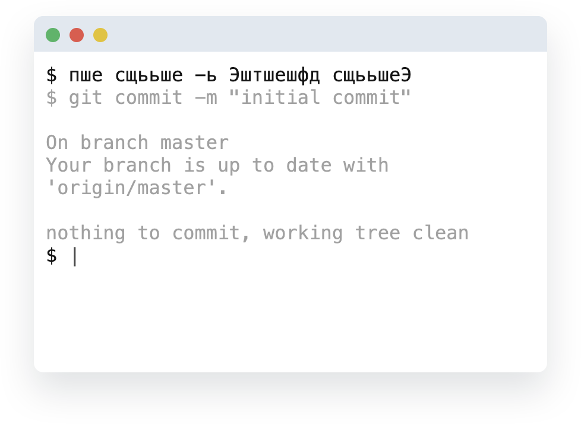

[npm-badge]: https://img.shields.io/npm/v/@danakt/pshe.svg
[npm-link]: https://npmjs.com/package/@danakt/pshe

# ПШЕ [![NPM][npm-badge]][npm-link]
Незаменимый помощник для работы с git. Вы больше не сможете представить себе разработку без этого инструмента.

<div align="center">
  
</div>

## Установка

```
yarn global add @danakt/pshe
```

или

```sh
npm install -g @danakt/pshe
```

## Разработка

### Установка

```sh
pnpm install
```

### Сборка

```sh
pnpm run build
```

### Запуск в режиме разработки

```sh
pnpm run dev
```

### Переменные окружения

- `PSHE_ISMAC` - Принудительно включить режим раскладки Mac (значения: 'true', '1'). Если не установлено, определяется автоматически на основе платформы.
